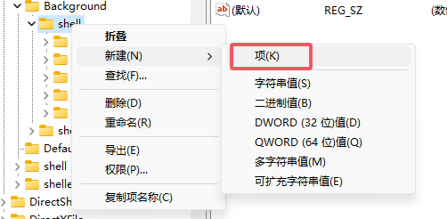

# Windows 自定义鼠标右键菜单

## 操作方法

#### _以【右键文件夹背景】打开【cmd 窗口】为例_

### 1.Windows 的右键菜单主要是通过【注册表（regedit）】控制，所以首先要打开【注册表编辑器】。

- 在键盘上按【Win+R】打开【运行】窗口

- 在【打开(<ins>O</ins>):】的输入框中输入：regedit

- 点击【确定】或【按回车键】打开【注册表编辑器】

    
    
从【运行】启动注册表编辑器

    
    
注册表编辑器

### 2.找到控制右键菜单的文件夹

在注册表中有 4 个路径负责控制右键菜单，4 个路径分别对应 4 个场景：

> // 右键单击桌面背景：  
> HKEY_CLASSES_ROOT\DesktopBackground\Shell

> // 右键单击文件：  
> HKEY_CLASSES_ROOT\*\shell

> // 右键单击文件夹：  
> HKEY_CLASSES_ROOT\Directory\shell

> // 右键单击文件夹背景：(在文件资源管理器中右键单击文件夹背景空白区域)  
> HKEY_CLASSES_ROOT\Directory\Background\shell

这里要在文件夹背景右键菜单中添加,所以我们在【地址栏】中输入:

> HKEY_CLASSES_ROOT\Directory\Background\shell

或依次点击【HKEY_CLASSES_ROOT】->【 Directory】->【Background】->【shell】

找到【shell】文件夹

    
    
找到shell文件夹

### 3.创建右键菜单选项

右键【shell】文件夹，选择【新建】，选择【项】，会创建一个文件夹,将其命名为"OpenCMD"(这个名称可以随便取)。

    
     
    "
    
shell下新建OpenCMD文件夹

使用相同操作在【OpenCMD】下面再新建一个项命名为【command】（必须是 command，但不区分大小写）的文件夹。

    
    
OpenCMD下新建OpenCMD文件夹

此时右键任意文件夹背景就可以看到【OpenCMD】选项了。

    

### 4.修改右键菜单选项名称以及添加默认图标

> 注册表编辑器左侧为目录树,右侧为属性清单

点击【OpenCMD】，在右侧属性清单中右键【默认】，点击【修改】，在弹出的【编辑字符串】窗口的【数值数据】中填写 “在此处打开命令窗口” (可随意填写)。

    
    
    
修改右键菜单选项名称

右键属性清单空白处,点击【新建】，点击【字符串值】，并重命名为“Icon”，将其数据值改为“cmd.exe”，点击确定。

    
    
    
修改右键菜单选项名称以及图标

此时右键任意文件夹背景就可以看到带有图标的【在此处打开命令窗口】选项了。

    

### 5.将选项与命令窗口关联

点击【OpenCMD】文件夹下的【command】文件夹，使用与上一步相同的操作，将属性清单中的【默认】的【数值数据】修改为 【cmd.exe /s /k "%V"】即可。

## 结果演示

    

